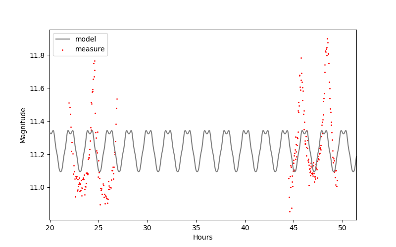
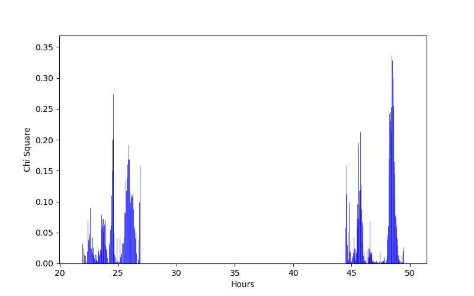
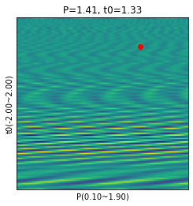
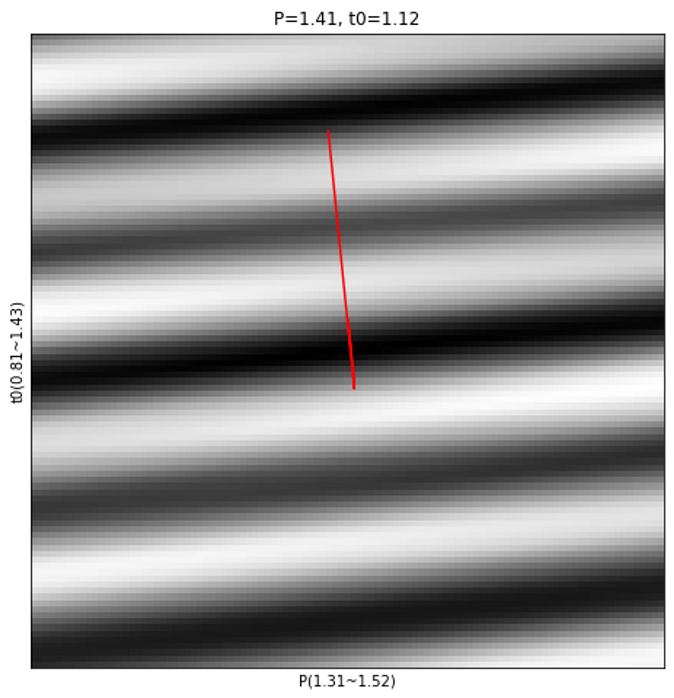
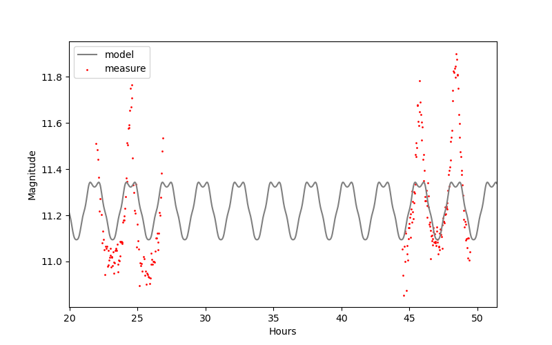
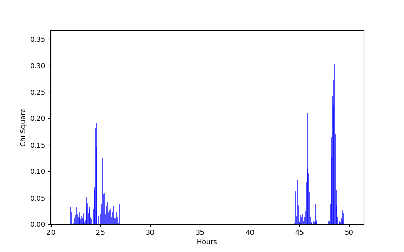
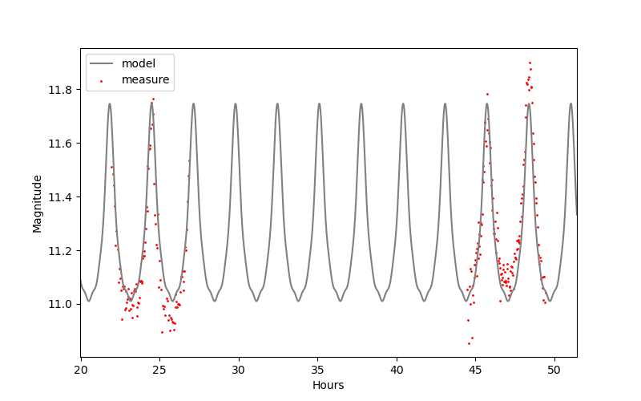
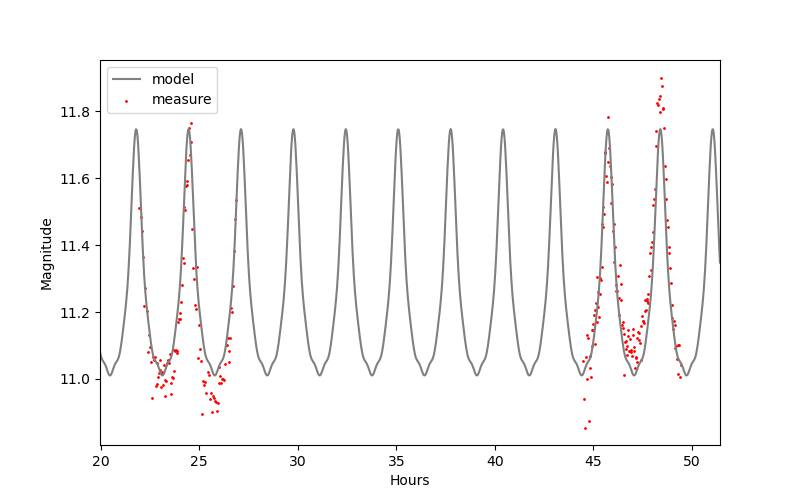
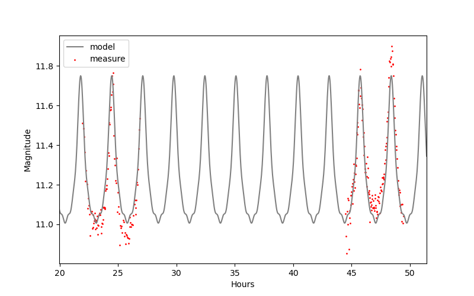
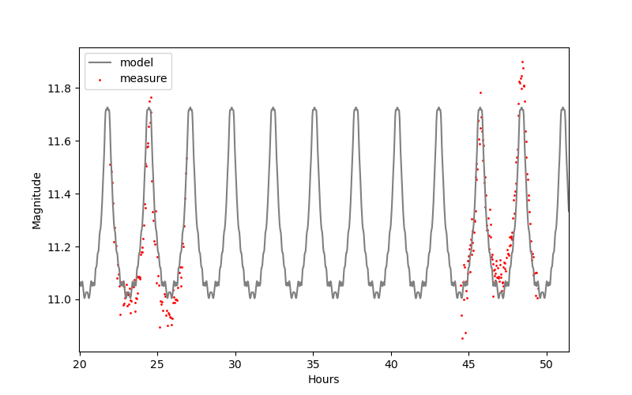

# Iteration of Light Curve Fitting   
Iterate least-squares and gradient-descent to search best parameters process for fitting light curve as Fourier series. Fourier series form is determined by 1993 SM Rucinski.   
$$ I(\theta) = \sum{a_n cos(2 \pi n \theta)} $$   
Adjust period $P$ and initial time $t_0$ in cosin function.   
$$ I(\theta) = \sum{a_n \frac{cos(2 \pi n (\theta - t_0))}{P}} $$   
For easily calculate best parameters, Seperate finding process as two. 
One is least-squares process for measuring coefficient parameters of fourier series as $a_n$. 
And other is gradienr descent process for measuring period and initial time parameters.   
   
## Example Data   
Magnitude datas for making light curve fitting process are CC com binary's data when 27 and 28 in April 2017, where CNU observatory. There are 108 point datas in 27 days and 142 point datas in 28 days.   
   
## Least-Squares Fitting
Actually it can be measured just using gradient descent that Fourier series parameters for $a_n$, $P$, $t_0$. 
However when process calculate all of these parameters, it takes a lot of time and computer resources. 
Even as a number of parameters are increased, required resources are much more increases exponentially.   
Then we get best parameters $a_n$ series values for using least-squares method with assumed $P$ and $t_0$ are constant values. 
For measuring minimum of $\chi^2$ which indicator calculating results of measuring best parameters, it needs to find $a_n$ parameters when derivative of $\chi^2$ became zero.   
That shows.   
$$ \frac{\partial}{\partial a} \sum{(I(\theta)-M(\theta)})^2=0 $$   
It can show as matrix.   
$$ F\times A = M $$   
$$ F = \left[
\begin{array}{cc}
    \sum 1&\sum C(b)&\sum C(2b)&\sum C(3b) \\
    \sum C(b)&\sum C(b)^2&\sum C(b)C(2b)&\sum C(b)C(3b) \\
\sum C(2b)&\sum C(b)C(2b)&\sum C(2b)^2&\sum C(2b)C(3b) \\
\sum C(3b)&\sum C(b)C(3b)&\sum C(2b)C(3b)&\sum C(3b)^2 \\
\end{array}
\right] $$
$$ A = \left[
\begin{array}{cc}
    a_0\\
    a_1\\
    a_2\\
    a_3\\
\end{array}
\right],
M = \left[
\begin{array}{cc}
    \sum M(\theta) \\
    \sum M(\theta)C(b) \\
    \sum M(\theta)C(2b) \\
    \sum M(\theta)C(3b) \\
\end{array}
\right] $$   
$a_n$ series parameters are obtained by solving $A$ matrix.   
And that used   
```python
python least_square.py --[option]
```  
It easily solved using numpy linear algebra calculating system.   
Results plot and graph show   
|Light Curve|$\Chi^2$ each point|
|-|-|
|||
   
## Gradient Descent Fitting   
It is hard to get best parameters about $P, t_0$ in least-squares method. 
When model have much more $a_n$ series values, The more solution much more complicated. 
Then in this process, We assumed $a_n$ series parameters are constant for easily get $P, t_0$ values.   
Set center point and width about $P, t_0$ values and divided as regular intervals. 
And find best parameters value which have minimum $\Chi^2$ points. 
If point of best parameter was located in end of width, center point on end of width. 
Other cases are just reduce width to find more detail value.   
It used   
```python
python gradi_descent.py
```   
Process calculate %\Chi^2% values as matrix array, Then it shows about like this   
|Finding step|Entire finding path|
|-|-|
|||
And results plot and graph show   
|Light Curve|$\Chi^2$ each point|
|-|-|
|||
   
## Iteration   
It's not enough just once use each process to get best parameters values. 
Therefore we make control process code which iterate least-squares method and gradient descent method. 
Code used as   
```python
python iterate_fitting.py
```   
Control code export plot and graph image in results folder.   
It shows   
|Least-Squares|Gradient Descent|
|-|-|
|||
|||
|||
$a_n$ series number can modify with add option on least-squares process code.   
And compare different $a_n$ series number as 7 and 24.   
|$n=7$|$n=24$|
|-|-|
|||
It needs careful about overfitting when using many $a_n$ series values.